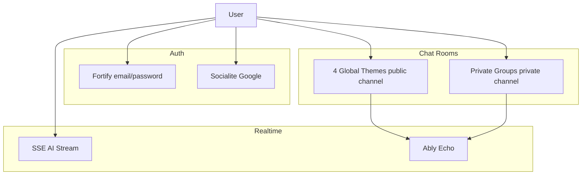

# Feature: private-room（私人聊天室 + Laravel 13 + Google OAuth）

> **文件性質：** 規格與分 phase 實作指南。  
> **階段 A（規格）：** 已完成 — 見 `progress.md`。  
> **階段 B（實作）：** 僅在被人類指派單一 Phase 時執行；禁止單次對話跑完 Phase 1–5。  
> **階段 C（Review）：** 實作完成後另開任務，見 `handoff.md` § Review。

---

## Objective

在維持現有 4 個全域主題聊天室與 SSE+Ably 架構的前提下：

1. 升級至 **Laravel 13** 及相容依賴。
2. 加入 **Google OAuth** 註冊/登入與設定頁帳號綁定（同 email 合併規則）。
3. 實作 **邀請制私人群組聊天室**（後端 + 前端 + private broadcast）。
4. 改版 **Welcome / Dashboard / 聊天導覽**，使面板與聊天頁切換合理。

**預期結果：** 登入使用者可建立私人房、產生邀請連結、成員可即時同步；非成員無法存取；公開主題房行為不變。

---

## Scope

### In Scope

- Laravel 13 + 相關 composer/npm 升級（Phase 1）
- Socialite Google：註冊、登入、設定頁 link/unlink（Phase 2）
- `private_group` 房：members、invitations、Policy、API、PrivateChannel（Phase 3）
- `ChatRoom.vue` 雙區導覽、私人房 UI、Welcome/Dashboard/AppLayout（Phase 4）
- Pest Feature tests、手動驗收清單、更新 `.ai-dev/README.md`（Phase 5）
- 規格治理：一 phase 一任務（見 `decisions.md` ADR-001）

### Out of Scope

- 1:1 私訊、個人 solo 房（僅本人）
- Presence / typing / 已讀
- 將 4 主題房改為 private channel
- SMTP 寄送邀請信（第一版僅複製連結）
- 將 AI SSE 串流改為 WebSocket
- 用 email 邀請未註冊訪客（第一版 accept 需已登入）

---

## Success Criteria（全專案）

- [ ] `php artisan about` 顯示 Laravel 13.x；`php artisan test` 全綠；`npm run build` 成功
- [ ] Google：**已佈署環境**可註冊/登入；同 email 不會重複建帳；設定頁可 link/unlink（unlink 有防呆）
- [ ] Google：**本機（local）** OAuth 關閉，登入/註冊/設定頁顯示停用說明（ADR-007）
- [ ] 私人房：owner 可建房、產生邀請、成員 accept；非成員 403；成員可發訊/AI；即時 private channel 同步
- [ ] 4 主題房：行為與升級前一致；仍為 public channel
- [ ] Welcome/Dashboard：公開房 vs 私人房 CTA 清楚；`route('chat.index')` 等路由正確
- [ ] `.ai-dev/README.md`「真實功能狀態」已更新

---

## Constraints

- 遵循專案既有慣例：Form Request、Policy、Pest、Pint、`vendor/bin/pint --dirty`
- **不要**一次實作多個 Phase（見 `handoff.md`）
- **不要**改寫 SSE 為 WebSocket
- 全域主題房 **禁止** 清空（既有 `canClearChatRoom` 邏輯）；私人房僅 owner 可清空
- `env()` 僅用於 config；OpenAI 模型仍由 `GPTService` 管理
- 每 Phase 結束必須更新 `progress.md` 並 STOP

---

## Edge Cases

| 情境 | 預期行為 |
|------|----------|
| Google 登入 email 已存在、未綁 google_id | 不建新帳；導向登入 + 設定綁定說明 |
| `APP_ENV=local` 或 `google.enabled=false` | 不顯示可用 Google 按鈕；顯示說明；OAuth 路由 404/403 |
| 佈署環境未設 `GOOGLE_OAUTH_ENABLED` 或缺 client 憑證 | 同樣視為未啟用 + 說明（可區分「未設定」文案，非必須） |
| 純 Google 使用者 unlink 且無密碼 | 拒絕 unlink |
| 邀請 token 過期 / 已撤銷 / 已滿員 | accept 失敗並顯示錯誤 |
| 非成員 POST 訊息到私人房 | 403 |
| 私人房 slug 與主題 slug 衝突 | 建立時驗證禁止 |
| 主題房 broadcast | 仍 `Channel`（public） |
| 私人房 broadcast | `PrivateChannel` + `channels.php` 成員檢查 |
| L13 升級後 Jetstream 不相容 | 記錄 `progress.md` Deviations；暫緩或 pin 相容版本 |

---

## 現況摘要（實作起點）

| 項目 | 現況 |
|------|------|
| Laravel | 12.35.1，`composer.json` `^12.0` |
| 聊天 | `ChatRoomController` + `ChatRoom.vue` |
| 主題房 | `ChatRoom::GLOBAL_THEME_DEFINITIONS` — work/study/creative/daily |
| 廣播 | Events 用 `Channel`（public）；`channels.php` 有 callback 但未用於 private |
| 認證 | Jetstream + Fortify；無 Socialite |
| 私人房 | 無產品功能；`getDefaultForUser()` 僅測試/遺留 |

**關鍵檔案：**

- `routes/web.php`
- `app/Http/Controllers/ChatRoomController.php`
- `app/Models/ChatRoom.php`, `Message.php`
- `app/Services/GPTService.php`, `MessageCacheService.php`, `ConversationContextService.php`
- `app/Events/ChatMessageCreated.php`, `AiReplyCompleted.php`, `ChatRoomCleared.php`
- `routes/channels.php`
- `resources/js/Pages/ChatRoom.vue`, `bootstrap.js`
- `resources/js/Pages/Welcome.vue`, `Dashboard.vue`, `Profile/Show.vue`

---

## Implementation Plan（分 Phase — 每次只執行一節）

### Phase 0 — 規格收斂 ✅（階段 A，已完成）

- 交付 `plan.md`, `progress.md`, `decisions.md`, `handoff.md`
- 唯讀盤點寫入 `decisions.md`

---

### Phase 1 — Laravel 13 與依賴升級（階段 B）

**進入條件：** 人類指派「只執行 Phase 1」。

**步驟：**

1. `composer require laravel/framework:^13.0`（連帶更新 pint、collision 等）
2. 依 https://laravel.com/docs/13.x/upgrade 檢查 `bootstrap/app.php`、棄用 API、config
3. 更新 Jetstream / Fortify / Sanctum / Inertia 至 lock 可解析版本
4. `npm update`（最小變動）
5. `vendor/bin/pint --dirty`
6. `php artisan test`
7. `npm run build`
8. 更新 `.ai-dev/README.md`、`docs/deployment.md` 版本敘述

**Phase 1 Success Criteria：**

- [ ] `php artisan about` → Laravel 13.x
- [ ] `php artisan test` 全綠
- [ ] `npm run build` 成功

**退出：** 更新 `progress.md` → **STOP**

---

### Phase 2 — Google OAuth（階段 B）

**進入條件：** Phase 1 已完成且測試全綠。

**套件：** `laravel/socialite`

**環境開關（ADR-007，必做）：**

```php
// config/services.php（示意，實作時放 config 勿散落 env）
'google' => [
    'client_id' => env('GOOGLE_CLIENT_ID'),
    'client_secret' => env('GOOGLE_CLIENT_SECRET'),
    'redirect' => env('GOOGLE_REDIRECT_URI'),
    // local 一律 false；非 local 才看 GOOGLE_OAUTH_ENABLED 與憑證是否齊全
    'enabled' => ! app()->environment('local')
        && filter_var(env('GOOGLE_OAUTH_ENABLED', false), FILTER_VALIDATE_BOOL)
        && filled(env('GOOGLE_CLIENT_ID'))
        && filled(env('GOOGLE_CLIENT_SECRET')),
],
```

- `.env.example`：`GOOGLE_OAUTH_ENABLED=false`；註解說明佈署環境改 `true` 並設定 redirect URI
- `docs/deployment.md`（或 `.ai-dev/README.md`）：補充 Google Console 僅登錄 production/staging 網域

**資料庫 migration（users）：**

- `google_id` nullable unique
- `google_token`, `google_refresh_token` nullable（hidden/encrypted）
- `password` nullable

**後端：**

| 元件 | 說明 |
|------|------|
| `GoogleAuthController` | `redirect`, `callback`；開頭檢查 `config('services.google.enabled')`，否則 abort(404) |
| 路由 | `auth/google/redirect`, `auth/google/callback` |
| 已登入 | `POST /user/google/link`, `DELETE /user/google/unlink`（同樣受 enabled 保護） |
| Form Request | unlink 前須有密碼或其他登入方式 |
| Inertia share | `googleOAuthEnabled`、`googleOAuthDisabledReason`（本機固定 reason 文案） |

**邏輯（ADR-004）：** email 已存在且無 `google_id` → 不建立使用者。

**前端（須在頁面直接說明，非僅 disabled 無文案）：**

- `Auth/Login.vue`, `Register.vue`：
  - `googleOAuthEnabled === true` → 顯示「使用 Google 繼續」
  - `false` → 停用樣式區塊 + 說明：*Google 登入／註冊僅在已佈署環境提供；本機請使用電子郵件與密碼。*
- `Profile/Partials/GoogleAccountForm.vue`：同上；未啟用時不顯示 link 按鈕，改顯示說明
- `Profile/Show.vue` — 引入 partial

**測試：** `tests/Feature/GoogleAuthTest.php`

- 啟用 OAuth 的 case：`config` + 非 `local` 環境（或 `$this->app->detectEnvironment(fn () => 'staging')`）
- `test_google_routes_disabled_on_local_environment`
- `test_login_page_shows_disabled_message_when_oauth_unavailable`（可 assert Inertia prop）

**Phase 2 Success Criteria：**

- [ ] **佈署設定下** 新 Google 使用者可登入
- [ ] 同 email 不重複建帳
- [ ] 設定頁 link/unlink 與測試通過（在 OAuth 啟用環境）
- [ ] **本機 `local`**：`googleOAuthEnabled` 為 false；Login/Register/Profile 有可見說明；OAuth 路由不可訪問

**退出：** 更新 `progress.md` → **STOP**

---

### Phase 3 — 邀請制私人房（後端）（階段 B）

**進入條件：** Phase 1 完成；建議 Phase 2 完成。

**資料模型：**

`chat_rooms` 新增：

- `type`: `global_theme` | `private_group`
- `created_by`: foreignId users

新表 `chat_room_members`:

- `chat_room_id`, `user_id`, `role` (`owner`|`member`), `joined_at`
- unique(`chat_room_id`, `user_id`)

新表 `chat_room_invitations`:

- `chat_room_id`, `token` unique, `invited_by`, `expires_at`, `accepted_at`, `accepted_by` nullable
- `revoked_at`, `max_uses` optional

**模型：** `ChatRoomMember`, `ChatRoomInvitation`；`ChatRoom` 加 `members()`, `isPrivateGroup()`, `hasMember()`, `isGlobalTheme()`（已有則擴充）

**Policy：** `ChatRoomPolicy` — view, sendMessage, clear, invite, removeMember, delete

**路由（建議）：**

```
GET    /chat/private
GET    /chat/private/{room}
POST   /chat/private
POST   /chat/private/{room}/invitations
POST   /chat/invitations/{token}/accept
DELETE /chat/private/{room}/members/{user}
```

`/chat/{theme}` **僅** 解析 4 主題 slug。

**重構：**

- `ChatRoomResolver` 或 `ResolvesChatRoom` trait
- `ChatRoomController` 訊息/send/stream/clear/loadMore 共用，resolve 分岐
- Inertia props: `roomMode`, `privateRooms`, `members`, `canClear`（後端計算）

**廣播：**

- Helper/concern：`global_theme` → `Channel`；`private_group` → `PrivateChannel`
- 更新三個 Event 的 `broadcastOn()`
- `routes/channels.php`：

```php
Broadcast::channel('chat-room.{chatRoomId}', function ($user, $chatRoomId) {
    $room = ChatRoom::find($chatRoomId);
    if (! $room) {
        return false;
    }
    if ($room->isGlobalTheme()) {
        return $user !== null;
    }
    return $room->hasMember($user);
});
```

**測試：** `tests/Feature/PrivateChatRoomTest.php`（403、邀請、broadcastOn）

**Phase 3 Success Criteria：**

- [ ] 成員 CRUD / 邀請 accept 通過測試
- [ ] 非成員 403
- [ ] 私人房事件為 PrivateChannel；主題房仍 public

**退出：** 更新 `progress.md` → **STOP**

---

### Phase 4 — 前端與導覽（階段 B）

**進入條件：** Phase 3 完成。

**ChatRoom.vue：**

- `ChatSidebar.vue`（建議）：區塊 A 四主題、區塊 B 私人房列表 + 建立
- 邀請連結 modal（複製 URL）
- `Echo.private()` vs `Echo.channel()` 依 `roomMode`
- `canClear` 用後端 prop

**Welcome.vue：** 修正 `route('chat')` → `chat.index`；CTA 分流

**Dashboard.vue：** 卡片 — 公開聊天 / 私人房 / 設定

**AppLayout.vue：** 導覽「私人聊天」；`/chat` 與 `/chat/private` 高亮

**Phase 4 Success Criteria：**

- [ ] 可從 Dashboard 進公開房與私人房列表
- [ ] 房內切換主題/私人房不 broken
- [ ] `npm run build` 成功

**退出：** 更新 `progress.md` → **STOP**

---

### Phase 5 — 整合驗證（階段 B）

**步驟：**

1. `php artisan test`
2. 手動驗收（見下方 Verification Plan）
3. 更新 `.ai-dev/README.md`
4. `progress.md` 標記「可進入階段 C Review」

**退出：** **STOP**，等待 Review 任務

---

## Verification Plan

### 自動

```bash
vendor/bin/pint --dirty
php artisan test
npm run build
```

### 手動（Phase 5）

1. **（僅已佈署環境）** Google 註冊新帳 → 登入成功
2. **（僅已佈署環境）** 既有 email 嘗試 Google 註冊 → 不建重複帳
2b. **（本機 local）** 登入/註冊/設定頁顯示 Google 不可用說明；直接開 `/auth/google/redirect` 應 404/403
3. 建立私人房 → 產生邀請連結
4. 第二帳號登入 accept → 雙方可見同房訊息
5. 第三帳號（非成員）開私人房 URL → 403
6. 主題房雙瀏覽器仍即時同步
7. Dashboard / Welcome 導覽符合預期

---

## 架構圖（目標狀態）



---

## 關鍵檔案清單（實作時）

| 領域 | 路徑 |
|------|------|
| 升級 | `composer.json`, `package.json` |
| OAuth | `app/Http/Controllers/GoogleAuthController.php`, migration, `config/services.php` |
| 私人房 | migrations, `ChatRoomPolicy`, `ChatRoomResolver`, controllers |
| 廣播 | `app/Events/*`, `routes/channels.php`, `resources/js/bootstrap.js` |
| UI | `ChatRoom.vue`, `ChatSidebar.vue`, `Welcome.vue`, `Dashboard.vue`, `AppLayout.vue` |
| 測試 | `tests/Feature/GoogleAuthTest.php`, `PrivateChatRoomTest.php` |

---

## 相關文件

- `.ai-dev/README.md`
- `docs/architecture.md`
- `docs/deployment.md`
- `docs/phase-2-checklist.md`
- `docs/realtime-websocket-plan.md`
- `.ai-dev/private-room/handoff.md`
- `.ai-dev/private-room/decisions.md`
