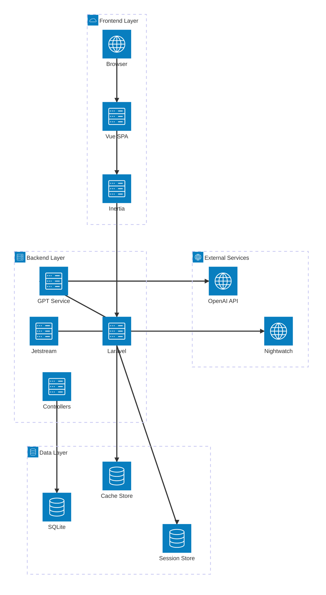
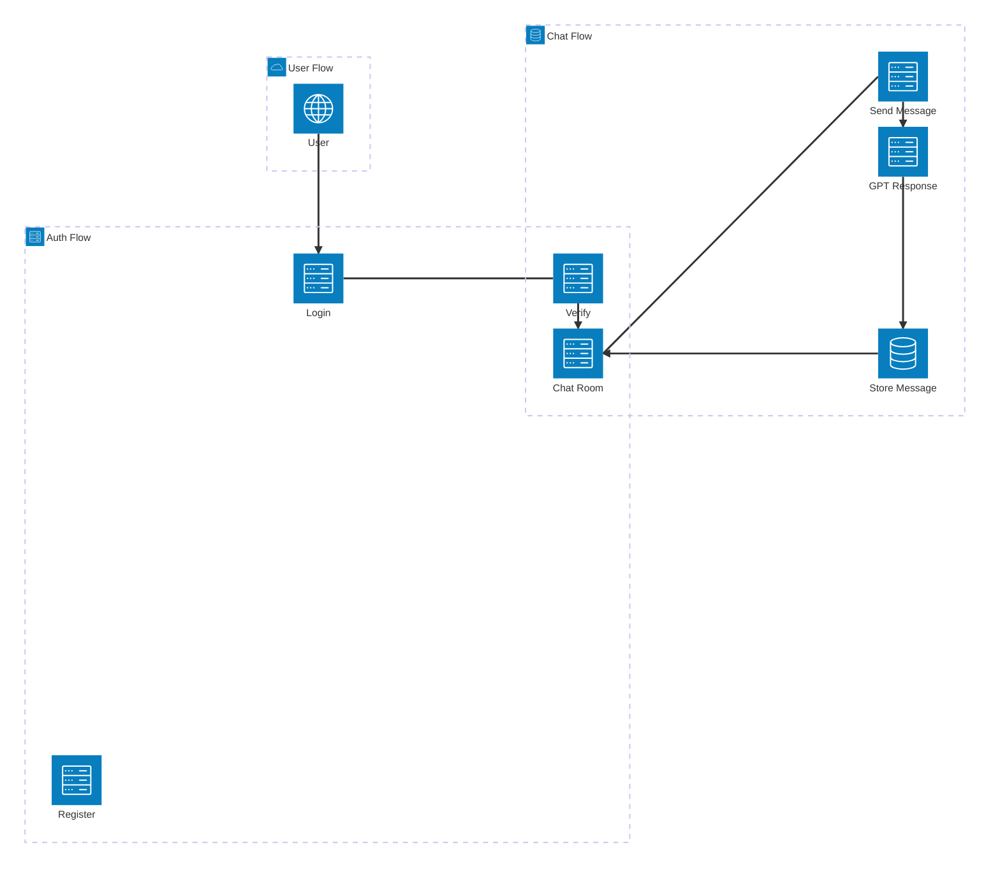
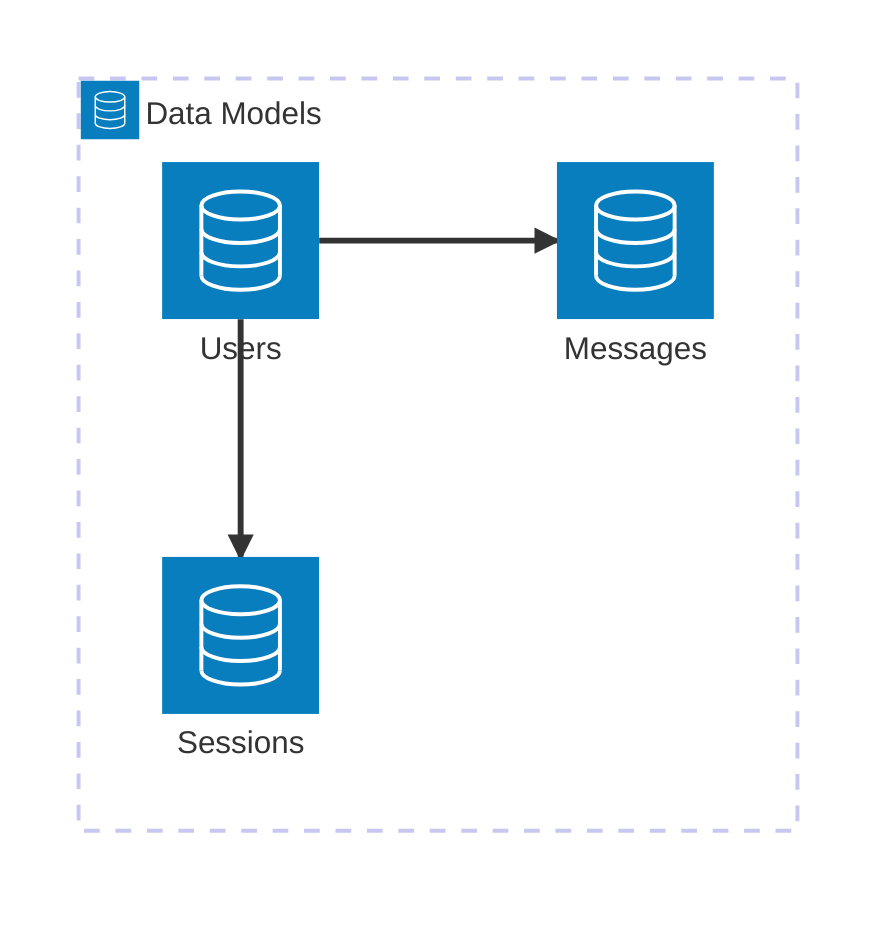

# GPTChatRoom 專案架構圖

這是一個基於 Laravel + Vue.js + Inertia.js 的 GPT 聊天室應用程式。

## 技術堆疊

### 後端 (Backend)
- **框架**: Laravel 13.x
- **認證**: Laravel Jetstream + Sanctum
- **資料庫**: SQLite
- **AI 服務**: OpenAI GPT-4o-mini
- **監控**: Laravel Nightwatch
- **快取**: Database-based Cache
- **Session**: Database-based Session

### 前端 (Frontend)
- **框架**: Vue.js 3.3.13
- **建構工具**: Vite 6.2.0
- **CSS 框架**: Tailwind CSS 3.4.0
- **路由**: Inertia.js — server `inertia-laravel` v3, client `@inertiajs/vue3` v1
- **Markdown 渲染**: Marked.js
- **HTTP 客戶端**: Axios

### 主要功能
1. **使用者認證**: 註冊、登入、雙因子認證
2. **即時聊天**: 與 GPT 進行對話
3. **訊息歷史**: 儲存和顯示聊天記錄
4. **Markdown 支援**: GPT 回應支援 Markdown 格式
5. **響應式設計**: 支援各種裝置尺寸

## 系統架構



## 主要功能流程



## 資料模型關係



## 專案檔案結構

```
GPTChatRoom/
├── app/
│   ├── Http/Controllers/
│   │   ├── ChatRoomController.php    # 聊天室控制器
│   │   └── HomeController.php        # 首頁控制器
│   ├── Models/
│   │   ├── User.php                  # 使用者模型
│   │   └── Message.php               # 訊息模型
│   ├── Services/
│   │   └── GPTService.php            # GPT API 服務
│   └── Providers/
│       └── GPTServiceProvider.php    # GPT 服務提供者
├── resources/
│   ├── js/
│   │   ├── Pages/
│   │   │   ├── ChatRoom.vue          # 聊天室頁面
│   │   │   ├── ChatRoomClient.vue    # 聊天室客戶端
│   │   │   └── Dashboard.vue         # 儀表板
│   │   └── Components/               # Vue 組件
│   └── css/
│       └── app.css                   # 主要樣式
├── database/
│   ├── migrations/
│   │   ├── create_users_table.php    # 使用者表格
│   │   └── create_messages_table.php # 訊息表格
│   └── database.sqlite               # SQLite 資料庫
├── routes/
│   └── web.php                       # 網頁路由
├── config/
│   ├── openai.php                    # OpenAI 配置
│   └── jetstream.php                 # Jetstream 配置
└── .env                              # 環境變數
```

## 核心組件說明

### 1. 聊天室控制器 (ChatRoomController)
- `index()`: 顯示聊天室頁面
- `client()`: 顯示聊天室客戶端並載入歷史訊息
- `sendMessage()`: 處理使用者訊息並調用 GPT API

### 2. GPT 服務 (GPTService)
- 封裝 OpenAI API 調用
- 錯誤處理和日誌記錄
- 使用 GPT-4o-mini 模型

### 3. 訊息模型 (Message)
- `user_id`: 關聯使用者
- `text`: 訊息內容
- `sender_type`: 發送者類型 ('user' 或 'gpt')

### 4. Vue 組件
- **ChatRoomClient.vue**: 主要聊天介面
  - 訊息顯示 (支援 Markdown)
  - 訊息發送
  - 載入狀態管理
  - 即時滾動
